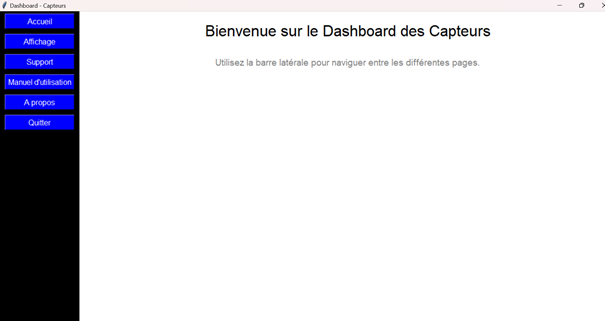
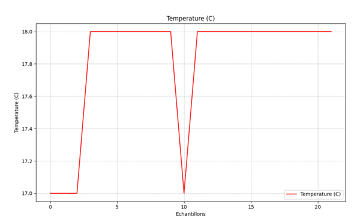
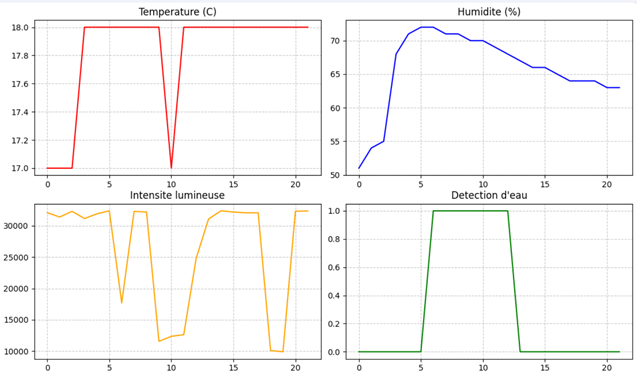
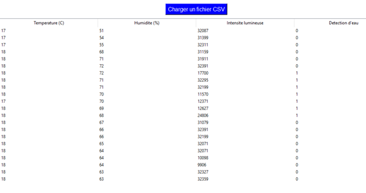

# environmental-monitoring-dashboard_DUT

# Environmental Monitoring Dashboard

A real-time environmental monitoring system built with Raspberry Pi Pico and a Python desktop dashboard for data visualization and logging.

## Overview

This project was developed as part of an Embedded Systems course. It collects environmental data using a Raspberry Pi Pico and several sensors. The measurements are stored in a CSV file and visualized through a desktop application developed with Python.

The monitored parameters include:

- Temperature
- Humidity
- Light intensity
- Water detection

## Features

- Real-time sensor acquisition
- Automatic CSV logging
- Interactive Python dashboard
- Six visualization modes
- Individual sensor graphs
- Combined graph
- CSV table view

## Hardware

- Raspberry Pi Pico H
- DHT11 temperature and humidity sensor
- LDR light sensor
- Water sensor
- Breadboard
- Jumper wires

## Software

- MicroPython
- Python
- Tkinter
- Pandas
- Matplotlib

## Project Structure

```
environmental-monitoring-dashboard/
│
├── micropython/
│   └── sensor_data_logger.py
├── dashboard/
│   └── dashboard.py
├── sample-data/
│   └── sensor_data.csv
├── images/
├── docs/
├── README.md
└── LICENSE
```

## System Architecture

```
Sensors
    │
    ▼
Raspberry Pi Pico
    │
    ▼
CSV Logging
    │
    ▼
Python Dashboard
    │
    ▼
Data Visualization
```

## Screenshots

### Hardware Setup


### Dashboard Home



### Temperature Graph



### Combined Graph



### CSV Table



## Installation

Clone the repository

```bash
git clone https://github.com/YourUsername/environmental-monitoring-dashboard.git
```

Install the required Python packages

```bash
pip install pandas matplotlib
```

Run the dashboard

```bash
python dashboard/dashboard.py
```

## Results

The system collects environmental data every five seconds, stores the measurements in CSV format, and provides several visualization modes for data analysis.

## Future Improvements

- Cloud storage
- Web dashboard
- Email notifications
- Mobile application

## Author

Layla Kaddani

Embedded Systems and IoT Engineering Student

## License

This project is licensed under the MIT License.
